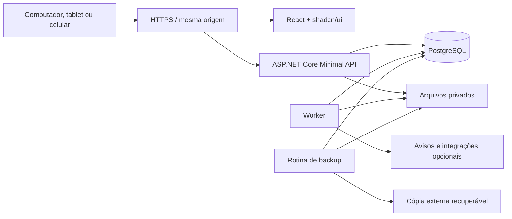

# Arquitetura e segurança

## 1. Escolha arquitetural

Monólito modular: um backend organizado por responsabilidades e um banco transacional, com API e worker como processos independentes. Isso mantém entradas, reservas, entregas e auditoria consistentes, e permite multiplicar as instâncias de processamento quando houver necessidade. Não exige event sourcing integral nem um serviço separado para cada cadastro.



A mesma aplicação pode rodar na empresa ou na internet. Em cada instalação, o PostgreSQL primário é a autoridade para confirmar operações. A página deve alcançar esse backend; instalar a interface em vários computadores não cria estoques independentes.

## 2. Stack proposta

| Camada | Escolha | Finalidade |
| --- | --- | --- |
| Runtime/API | .NET 10 LTS, ASP.NET Core Minimal APIs | Endpoints organizados por módulo e execução dos casos de uso |
| Persistência | EF Core 10 + Npgsql 10 compatível | Mapeamento, transações, migrations e consultas; SQL explícito nos trechos críticos |
| Banco | PostgreSQL 18 | Dados relacionais, integridade, busca e processamento de filas persistentes |
| Frontend | React + TypeScript + Vite | Aplicação administrativa responsiva, sem necessidade inicial de renderização no servidor |
| Interface | shadcn/ui + Tailwind CSS | Componentes mantidos no repositório e identidade visual consistente |
| Estado remoto | TanStack Query | Consultas, cache de tela e invalidação depois de mutações |
| Rotas e tabelas | React Router e TanStack Table | Navegação e tabelas com ordenação/filtro/paginação executados no backend |
| Formulários | React Hook Form + Zod | Validação de interação; regras definitivas continuam no backend |
| Contrato | OpenAPI e cliente TypeScript gerado | Reduzir divergência entre API e frontend |
| Jobs | Worker .NET com fila/outbox no PostgreSQL | Importações, exportações, alertas e tarefas recuperáveis |
| Diagnóstico | Logs estruturados e OpenTelemetry | Rastrear operações, falhas, latência e filas |
| Testes | xUnit, PostgreSQL real de teste e Playwright | Regras, concorrência, integração e jornadas no navegador |

.NET 10 consta como LTS na [política oficial de suporte](https://dotnet.microsoft.com/en-us/platform/support/policy); PostgreSQL 18 consta na [política de versões](https://www.postgresql.org/support/versioning/). O provedor possui [linha 10](https://www.npgsql.org/efcore/release-notes/10.0.html). Fixar versões exatas e lockfiles no início da implementação, usando patches suportados e validando o conjunto de dependências; este documento não fixa números de patch.

shadcn/ui fornece código de componentes para incorporar e adaptar no projeto, conforme sua [documentação](https://ui.shadcn.com/docs). A manutenção inclui revisar atualizações desses componentes. Escolher um único conjunto de primitivas suportado pelo preset adotado e manter consistência no projeto.

## 3. Estrutura proposta do repositório

```text
src/
  backend/
    StorageManager.Api/
    StorageManager.Worker/
    StorageManager.Core/
      IdentityAccess/
      Organizations/
      Catalog/
      Locations/
      Inventory/
      Operations/
      ImportsExports/
      Notifications/
      Reporting/
      Audit/
    StorageManager.Infrastructure/
  frontend/
    src/app/
    src/features/
    src/components/ui/
    src/components/shared/
    src/lib/
    src/api/generated/
tests/
  Domain.Tests/
  Integration.Tests/
  Architecture.Tests/
  e2e/
deploy/
docs/
```

Essa árvore é uma proposta; ainda não foi criada. Cada feature agrupa comando/consulta, validação, regra e testes. Endpoints traduzem HTTP e chamam casos de uso. O módulo Inventory é o único autorizado a efetivar quantidade. Os demais módulos pedem movimentos por interfaces explícitas, dentro da mesma unidade de trabalho quando necessário.

Começar com um contexto transacional EF Core e mappings organizados por módulo, evitando transações distribuídas entre contextos para um mesmo movimento. Consultas usam projeções diretas para DTOs. Não adicionar repositório genérico sobre EF Core sem necessidade identificada. Reportar dependências entre módulos em testes de arquitetura.

## 4. Sessão, login e autorização

Usar ASP.NET Core Identity para credenciais, recuperação e MFA; sessão do navegador por cookie `HttpOnly`, `Secure`, `SameSite` apropriado, sob HTTPS, com frontend e API na mesma origem. Proteger explicitamente as operações autenticadas por cookie contra CSRF, inclusive endpoints JSON e uploads. A Microsoft recomenda cookies para aplicações de navegador na [orientação para SPAs](https://learn.microsoft.com/en-us/aspnet/core/security/authentication/identity-api-authorization?view=aspnetcore-10.0); o tratamento de CSRF precisa seguir a [documentação antiforgery](https://learn.microsoft.com/en-us/aspnet/core/security/anti-request-forgery?view=aspnetcore-10.0).

Não abrir cadastro público de administradores. O primeiro administrador é criado por provisionamento de instalação de uso único; depois, usuários são convidados ou criados por administradores autorizados. Em instalação sem e-mail, recuperação administrativa usa credencial temporária de uso único, exige troca de senha e registra o responsável. Não depender de serviço de identidade externo para a operação LAN.

Prever MFA para administradores, bloqueio/rate limit de tentativas, sessões com expiração e revogação. Suspender usuário ou associação à organização deve impedir novas operações imediatamente, mediante consulta de sessão/membership ativo no servidor, sem aguardar horas por expiração de cookie. O usuário pode listar e encerrar suas sessões. Persistir as chaves de Data Protection, protegê-las em repouso e compartilhá-las ao replicar a API.

Autorização é verificada por ação e recurso: organização, raiz de estoque, local, documento e vínculo com solicitante. O frontend ajuda a navegação, mas nunca decide sozinho se uma operação é permitida. Mudanças de permissões, reset de senha, exportações sensíveis e ações administrativas geram auditoria.

A persistência e proteção das chaves seguem as opções de [Data Protection](https://learn.microsoft.com/en-us/aspnet/core/security/data-protection/configuration/overview?view=aspnetcore-10.0). Integrações futuras terão identidade própria e escopos limitados; adotar padrões OIDC/OAuth quando houver SSO ou clientes externos. Não apresentar os tokens proprietários do Identity como um servidor OAuth completo.

## 5. Separação entre organizações e locais

`OrganizationId` integra todas as entidades de negócio, unicidades, índices relevantes e relacionamentos entre entidades da organização. Usar FKs compostas `(OrganizationId, EntityId)` para impedir vínculos cruzados. Uma conta de usuário pode pertencer a várias organizações; papéis e escopos pertencem à associação, não à conta global.

Resolver a organização ativa a partir de uma associação autenticada. Um identificador enviado pelo navegador não concede acesso. Consultas de totais, sugestões de busca, notificações, imagens, exports e jobs seguem esse contexto. Cada job registra organização, solicitante e escopo; execução e download revalidam autorização, inclusive após revogação.

Para hospedagem compartilhada entre clientes, adotar também Row-Level Security. O contexto deve ser definido por transação, sem vazar pelo pool de conexões; usar papel runtime sem propriedade das tabelas nem `BYPASSRLS`, e credencial de migration separada. RLS reforça isolamento da organização; permissões por local continuam no domínio. A documentação explica as exceções dos proprietários/superusuários em [Row Security Policies](https://www.postgresql.org/docs/18/ddl-rowsecurity.html). O lançamento multiempresa depende de testes explícitos desse isolamento.

Na árvore de locais, escopo de um pai pode incluir descendentes conforme política explícita. Transferir envolve autorização na origem para expedir e no destino para receber. Alterar a árvore também altera escopos herdados e exige auditoria e invalidação das permissões calculadas.

## 6. Contrato HTTP proposto

Prefixo `/api/v1`. Usar comandos de negócio para eventos que mudam estado, DTOs explícitos e erros `ProblemDetails` com código de negócio e identificador de rastreamento. Exemplos:

| Grupo | Rotas ilustrativas |
| --- | --- |
| Sessão | `POST /auth/login`, `POST /auth/logout`, `GET /me`, `GET /me/sessions` |
| Cadastros | `GET/POST /products`, `GET/POST /skus`, `GET/POST /locations`, `GET/POST /parties` |
| Consulta | `GET /stock`, `GET /stock/ledger`, `GET /skus/{id}/history` |
| Entradas | `POST /receipts`, `POST /receipts/{id}/post` |
| Distribuição | `POST /requests`, `POST /requests/{id}/approve`, `POST /requests/{id}/reserve`, `POST /issues/{id}/post` |
| Transferências | `POST /transfers/{id}/dispatches`, `POST /transfers/{id}/receipts` |
| Remanejamento | `POST /relocations`, `POST /relocations/{id}/post` |
| Retornáveis | `POST /loans`, `POST /loans/{id}/issues`, `POST /loans/{id}/returns` |
| Inventário | `POST /counts`, `POST /counts/{id}/start`, `POST /counts/{id}/approve`, `POST /counts/{id}/apply` |
| Correção | `POST /movements/{id}/reversals` |
| Dados | `POST /imports`, `POST /imports/{id}/validate`, `POST /imports/{id}/commit`, `POST /exports`, `GET /jobs/{id}` |

`GET` não altera negócio. `POST` de confirmação aceita `Idempotency-Key`. Documentos editáveis expõem uma versão para detectar edição concorrente; conflito retorna `409`. Validação retorna `400` com campos afetados; não autenticado `401`; acesso negado `403`, ou `404` para recurso fora do escopo cuja existência não deva ser exposta. Operação assíncrona retorna `202` e endereço de acompanhamento.

Consultas possuem tamanho máximo de página, ordenações permitidas e desempate por identificador. Usar paginação por cursor no extrato volumoso. Decimais são representados por strings em contratos de quantidade/custo para preservar precisão; o frontend usa formatação decimal apropriada, sem arredondar silenciosamente via ponto flutuante. Datas operacionais e instantes UTC são campos distintos.

## 7. Confirmação transacional e concorrência

Protocolo único, usado por tela, importação e integração:

1. Validar sessão, organização, escopo e formato. Iniciar transação curta no banco primário.
2. Adquirir/verificar a chave de idempotência com unicidade por organização, ator, operação e chave; comparar o hash da requisição. Mesma chave com outro conteúdo gera conflito.
3. Bloquear o documento e os identificadores de série envolvidos. Adquirir bloqueios de localização respeitando o protocolo de inventário; ordenar os recursos em todas as operações.
4. Garantir as posições de saldo por inserção concorrente segura e índice único, incluindo dimensões nulas; então bloquear as posições e reservas em ordem determinística.
5. Revalidar versão, estado, elegibilidade, prazo, quantidade disponível, reserva, pendência de retorno e alçada. Saldo da tela ou do cache não é autorização.
6. Gravar movimento e suas linhas; atualizar físico, reservas, localização dos seriais e documentos; gravar auditoria, outbox e resultado idempotente na mesma transação.
7. Confirmar tudo. Somente após commit devolver sucesso. O worker cuida dos efeitos externos posteriormente.

Propor `Read Committed` com bloqueios explícitos e atualizações condicionais para as posições. PostgreSQL mantém os bloqueios de linha até o fim da transação, conforme [Explicit Locking](https://www.postgresql.org/docs/18/explicit-locking.html). Um `SELECT FOR UPDATE` sobre linha inexistente não resolve a criação concorrente: a chave única e o upsert são necessários. Serializar operações sobre a mesma série usando também sua linha de registro evita duplicá-la em posições diferentes.

Retentar a transação inteira em deadlock/falha de serialização, com limite e atraso curto. Não retentar falhas de regra. Nunca manter a transação aberta enquanto uma pessoa preenche a tela ou enquanto se envia e-mail. Atualizações condicionais confirmam que os limites continuam satisfeitos; uma falha desfaz o conjunto.

Para contagem: movimentos, remanejamentos, criação/realocação de reservas, reclassificações e importações adquirem `FOR SHARE` nas linhas dos endereços afetados e verificam ausência de bloqueio de inventário. Iniciar contagem adquire `FOR UPDATE` nesses endereços, espera operações em andamento terminarem, rejeita escopo já bloqueado por outra contagem, grava `BlockedByStockCountId` e obtém o saldo de corte. Materializar os endereços incluídos e impedir mudanças estruturais que alterem esse escopo até o encerramento.

Aplicação/cancelamento adquire os locks necessários e só libera bloqueios pertencentes à própria contagem. Liberação/expiração de reserva pode ocorrer durante contagem, com locks nas reservas e sincronização final antes de aplicar o ajuste. A aplicação do ajuste pela contagem proprietária é a exceção explícita ao bloqueio de movimento; não manter conexão aberta durante a contagem humana. Esse protocolo elimina a corrida entre conferir o bloqueio e efetivar uma escrita.

Chaves HTTP têm retenção definida, mas cada efeito possui também unicidade permanente por documento/ação ou evento de entrega/recebimento. O retry de uma confirmação antiga não pode duplicá-la depois da expiração de uma chave. Uma requisição repetida só retorna resultado depois de revalidar o acesso atual.

## 8. Jobs e consistência de leitura

Outbox persistida no commit; worker recebe tarefas com lease, tentativas, próxima execução, erro e estado final. Workers concorrentes não devem executar o mesmo lease ativo. Se ocorrer falha após um efeito externo e antes do ack, poderá haver repetição; consumidores deduplicam por evento. Nunca prometer entrega exatamente uma vez de e-mail.

Saldo, reservas e documento são imediatamente consistentes. Painéis e agregados podem ter pequeno atraso declarado. Notificação na tela pode usar polling no começo; SignalR é opcional depois. Não usar réplica atrasada para confirmar saída, empréstimo ou inventário.

## 9. Implantação e evolução de escala

Perfis suportados: servidor local em rede interna ou servidor/serviço na internet. Usar domínio e HTTPS em ambos. Uma implantação local também pode ser acessível remotamente por VPN ou proxy publicado com configuração apropriada; não expor diretamente PostgreSQL ou compartilhamento de arquivos.

Empacotar frontend, API e worker como artefatos reproduzíveis; desenvolvimento e instalação pequena podem usar Compose. Para empresa que só tenha servidor Windows, validar VM Linux ou serviços compatíveis com a infraestrutura escolhida. Provisionamento de produção, segredos, certificados e backups são parte da entrega. Um único host oferece simplicidade, mas é um ponto único de falha.

| Sinal medido | Próxima ação |
| --- | --- |
| Consulta lenta | Analisar SQL/planos, índices, filtros e paginação antes de acrescentar infraestrutura |
| API saturada, banco saudável | Multiplicar APIs; compartilhar chaves, armazenamento e estado de sessão |
| Fila atrasada | Multiplicar workers, limitar concorrência por organização e priorizar tarefas |
| Relatório pesa no banco | Pré-agregar, executar assíncrono e considerar réplica com atraso explícito |
| Ledger muito grande | Medir índices/manutenção e avaliar particionamento com estratégia de unicidade |
| Cliente domina os recursos | Quotas, isolamento de jobs e possibilidade de banco dedicado |
| Módulo exige ciclo/escala próprios | Avaliar extração mantendo estoque/reserva dentro do mesmo limite transacional |

Redis, broker externo, Kubernetes e serviços separados são opções futuras, sem obrigatoriedade inicial. A capacidade será validada por teste de carga com volume e hardware declarados. “Escalável” não equivale a um número garantido de usuários sem medição.
